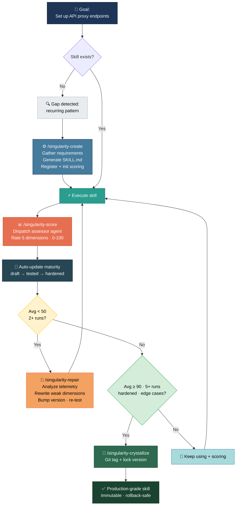
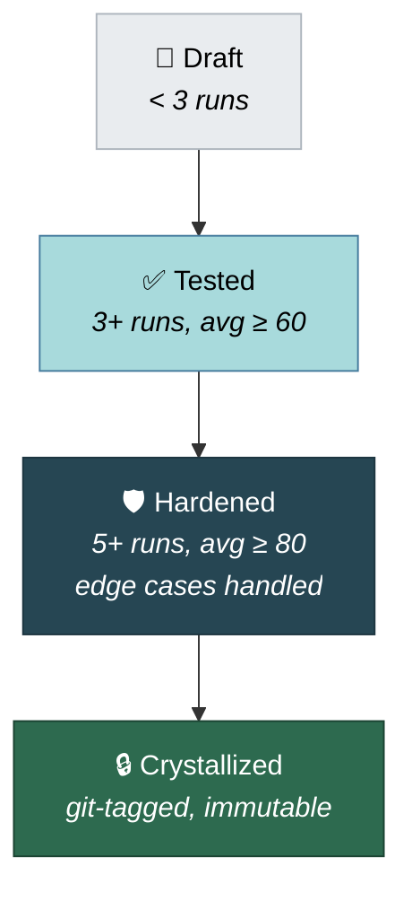

<p align="center">
  <h1 align="center">singularity-claude</h1>
  <p align="center">
    <strong>Skills that evolve themselves.</strong>
    <br />
    A self-evolving skill engine for Claude Code — create, score, repair, and crystallize skills through autonomous recursive improvement loops.
  </p>
  <p align="center">
    <a href="https://opensource.org/licenses/MIT"></a>
    <a href="#installation"></a>
    
    
  </p>
</p>

---

## The Problem

Claude Code skills are **static**. You write them once, and they stay exactly as they are — even when they fail, produce subpar output, or encounter new edge cases. There's no feedback loop, no way to know which skills are working well, and no mechanism to improve them over time.

You end up with a growing pile of skills where some work great, some are mediocre, and some are silently broken. The only way to fix them is manual review.

## The Solution

**singularity-claude** adds a recursive evolution loop to your skills:



> **Tip:** Click the expand button (↔) on the diagram to see the full interactive flow.

Skills are scored after every execution. Low scores trigger automatic repair. High scores lead to crystallization — a locked, battle-tested version you can trust. Every step is logged for full auditability.

**No external dependencies.** No SmythOS, no OpenTelemetry collector, no Docker. Pure Claude Code.

## What's Inside

### Skills (7)

| Skill | Command | Purpose |
|-------|---------|---------|
| **using-singularity** | *(auto-loaded)* | Bootstrap context + capability gap detection |
| **creating-skills** | `/singularity-create` | Build new skills through a structured workflow |
| **scoring** | `/singularity-score` | Rate execution on a 5-dimension rubric (0-100) |
| **repairing** | `/singularity-repair` | Auto-fix failing skills by analyzing score history |
| **crystallizing** | `/singularity-crystallize` | Lock validated versions via git tags |
| **reviewing** | `/singularity-review` | Health check with trend analysis |
| **dashboard** | `/singularity-dashboard` | Overview of all managed skills |

### Agents (2)

| Agent | Model | Purpose |
|-------|-------|---------|
| **skill-assessor** | Haiku | Fast, cheap automated scoring against the rubric |
| **gap-detector** | Haiku | Analyzes failed tasks to find missing skill capabilities |

### Scripts (2)

| Script | Purpose |
|--------|---------|
| `score-manager.sh` | CLI for reading/writing score JSON files (atomic writes, jq/node fallback) |
| `telemetry-writer.sh` | CLI for structured execution logging with replay support |

## Installation

### From marketplace

```bash
# Add the marketplace
claude plugin marketplace add shmayro/singularity-claude

# Install the plugin
claude plugin install singularity-claude
```

### From source

```bash
git clone https://github.com/shmayro/singularity-claude.git
cd singularity-claude
claude plugin marketplace add .
claude plugin install singularity-claude
```

## Quick Start

```bash
# 1. Start a new Claude Code session — singularity loads automatically

# 2. Create your first skill
/singularity-create

# 3. Use the skill, then score it
/singularity-score

# 4. Check the dashboard
/singularity-dashboard
```

That's it. The evolution loop starts running from the first score.

## How It Works

### The Evolution Loop

**1. Create** — `/singularity-create` walks you through building a new skill: requirements gathering, duplicate checking, SKILL.md generation, registry registration, and initial scoring.

**2. Score** — After every skill execution, `/singularity-score` dispatches a Haiku assessor agent that rates the output on 5 dimensions:

| Dimension | What It Measures |
|-----------|-----------------|
| **Correctness** (0-20) | Did it achieve the goal? |
| **Completeness** (0-20) | Were all requirements addressed? |
| **Edge Cases** (0-20) | Did it handle unusual inputs? |
| **Efficiency** (0-20) | Was the approach direct and minimal? |
| **Reusability** (0-20) | Could the output be reused? |

**3. Repair** — When a skill's average drops below 50 (configurable), `/singularity-repair` kicks in: reads score history + telemetry, identifies the weakest rubric dimensions, rewrites the skill to fix them, bumps the version, and re-tests.

**4. Harden** — Each edge case encountered is recorded. Skills that handle more edge cases with higher scores progress through maturity levels.

**5. Crystallize** — Once a skill hits 90+ average over 5+ runs with edge cases handled, `/singularity-crystallize` locks it with a git tag. Crystallized skills are immutable — a production-grade snapshot you can always roll back to.

### Maturity Progression



### Capability Gap Detection

The `using-singularity` skill (injected at every session start) teaches Claude to recognize when a new skill is needed:

- **Repetition** — Doing the same multi-step procedure across sessions
- **Failure without coverage** — No existing skill addresses the task
- **Generalizable pattern** — The procedure applies beyond the current task

When a gap is detected, Claude suggests creating a new skill automatically.

## Data Storage

All data is local. Nothing leaves your machine.

```
~/.claude/singularity/
├── scores/          # Score history per skill (JSON)
├── telemetry/       # Execution logs per skill (JSON)
├── registry.json    # All managed skills
└── config.json      # Thresholds and preferences
```

## Configuration

Edit `~/.claude/singularity/config.json`:

```json
{
  "autoRepairThreshold": 50,
  "crystallizationThreshold": 90,
  "crystallizationMinExecutions": 5,
  "scoringMode": "auto"
}
```

| Setting | Default | Description |
|---------|---------|-------------|
| `autoRepairThreshold` | 50 | Average score below this triggers repair suggestion |
| `crystallizationThreshold` | 90 | Average score above this enables crystallization |
| `crystallizationMinExecutions` | 5 | Minimum runs before crystallization is allowed |
| `scoringMode` | `"auto"` | `"auto"` (agent scores), `"manual"` (you score), `"hybrid"` (agent scores, you override) |

## Integration

- Works alongside [superpowers](https://github.com/obra/superpowers) and other Claude Code plugins
- Skills namespaced as `singularity-claude:*` — no conflicts
- Created skills go to `~/.claude/skills/` — the standard Claude Code location, usable by any plugin

## Requirements

- [Claude Code](https://docs.anthropic.com/en/docs/claude-code) CLI
- `jq` (recommended) or Node.js (fallback) for JSON manipulation
- Git (optional, for crystallization via tags)

## Inspired By

[Moltron](https://github.com/adridder/moltron) — a self-evolving skill engine built on SmythOS. singularity-claude takes the same core ideas (scoring, auto-repair, crystallization, hardening) and rebuilds them natively for Claude Code with zero external dependencies.

## Contributing

Contributions welcome! See [CONTRIBUTING.md](.github/CONTRIBUTING.md) for guidelines.

**Ideas for contributions:**
- New scoring rubric dimensions
- Additional maturity metrics
- Platform support (Cursor, Codex, Gemini CLI)
- Skill templates for common patterns

## License

[MIT](LICENSE) — use it however you want.

---

<p align="center">
  <sub>Built with Claude Code. Skills that improve themselves.</sub>
</p>
